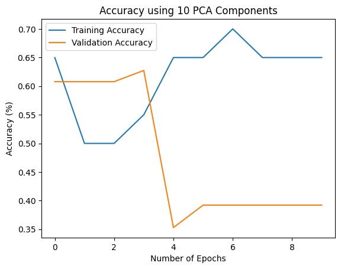
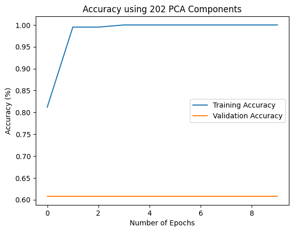

# MRI Tumor Classification

This repository attempts to classify brain tumors from MRI images given various machine learning classifiers. 

The data was gathered from [this Kaggle dataset](https://www.kaggle.com/datasets/navoneel/brain-mri-images-for-brain-tumor-detection), which separates MRI images by 'no' and 'yes'. 

The methods used to classify the MRI images used in this repo include using a Convolutional Neural Network (CNN), performing Principal Component Analysis (PCA) on the training images that are fed into the CNN, and K-Nearest Neighbors (KNN). 

## Description of Files 

### Scripts
1. **CNN.ipynb** : Details the steps performing a CNN on the MRI images found in  **no/** and **yes/**. CNN was run with 10 epochs. 

2. **PCA_CNN.ipynb** : Details the steps performing a CNN on the MRI images found in **no/** and **yes/**. Training images were run through PCA before inputting into CNN. The number of components tested are the following: 2, 10, 30, and all (202) the components. CNN was run with 10 epochs. 

3. **KNN.ipynb** : Details the steps performing KNN on the MRI images found in **no/** and **yes/**. KNN was iterated through all the odd numbers from 1 to 101 neighbors. A cross-validation of 5-folds was used.

### Other
3. **no/** : Folder with MRI images that were classified as having no tumor. 

4. **yes/** : Folder with MRI images that were classified as having a tumor. 

## Results

### CNN
Accuracy after 10 epochs: 78.43%

### PCA with CNN
2 component accuracy: 39.22%

10 component accuracy: 41.18%

30 component accuracy: 66.67%

202 component accuracy: 60.78%

### KNN
Highest Cross-Validation Accuracy: 77.49% at 73 nearest neighbors

